# Facial emotion recognition

**Case study:** [rnle.github.io/profile/projects/facial-emotion-recognition](https://rnle.github.io/profile/projects/facial-emotion-recognition/)

Seven architectures, one cleaned face dataset, one training pipeline. How much does each
architecture gain from **hyperparameter optimization**, and how far can the best go with
**longer training**, **grokking**, and **model compression**? PyTorch and Optuna, every model
trained from scratch on 48 × 48 grayscale faces.

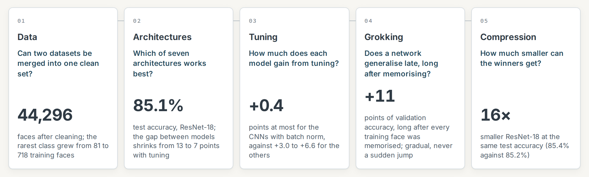

## The studies

### 1. Data: two datasets, one clean set

FER2013 (with FER+ labels, ten votes per face) and RAF-DB, merged into **44,296 faces**.
Removed: faces the annotators disagreed on, near-duplicates (perceptual hash), and labels
outside the seven emotions. Duplicates never cross the train, validation and test split.
RAF-DB lifts the rarest class, disgust, from 81 to 718 training faces.

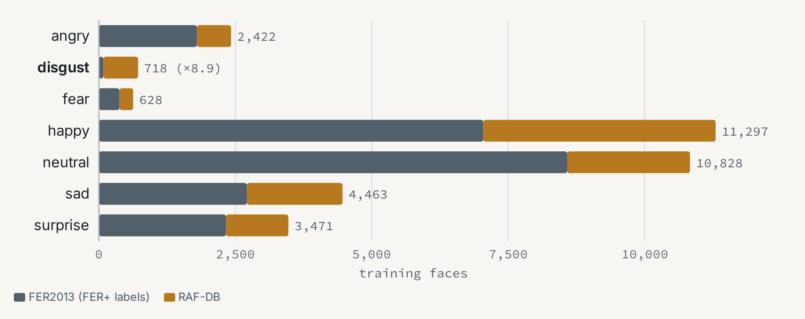

### 2. Architectures: seven models compared

Simple CNN, VGG, ResNet-18, DenseNet-BC, ViT, ConvNeXt, and CCT (compact convolutional
transformer), plus an ImageNet-pretrained ResNet-18 as a reference. Batch norm decides the
ranking: **ResNet-18, VGG and DenseNet lead at about 85% test accuracy**, and tuning shrinks
the spread between the models from 13 to 7 points.

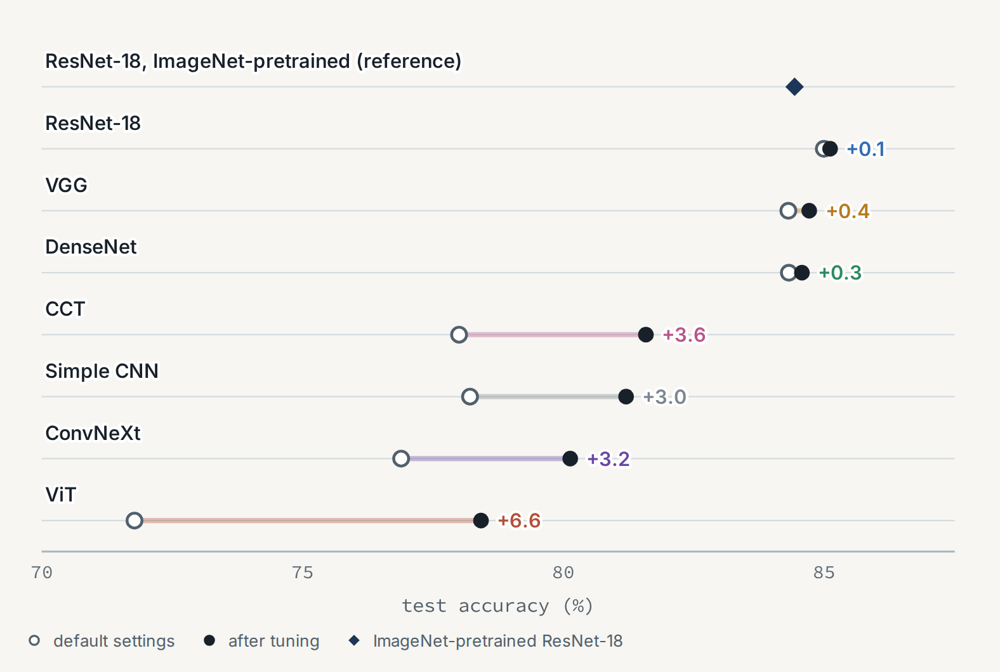
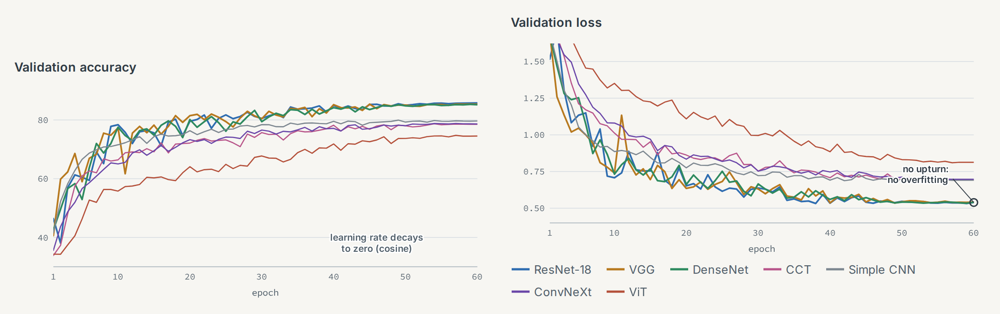
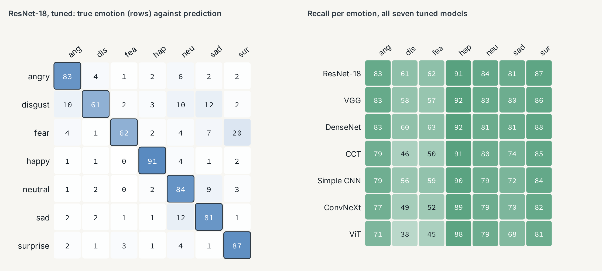

### 3. Hyperparameter optimization: sensitivity and shape

Optuna (TPE) with the same budget per model: 30 trials of 25 epochs over learning rate,
weight decay, warmup, batch size, class weights, label smoothing, augmentation, and dropout,
with fANOVA importances. The CNNs with batch norm gain at most 0.4 points; the others 3 to 7.
A second stage searches the network's shape (width, depth, stages) for the three winners:
+0.2 points, within the noise.

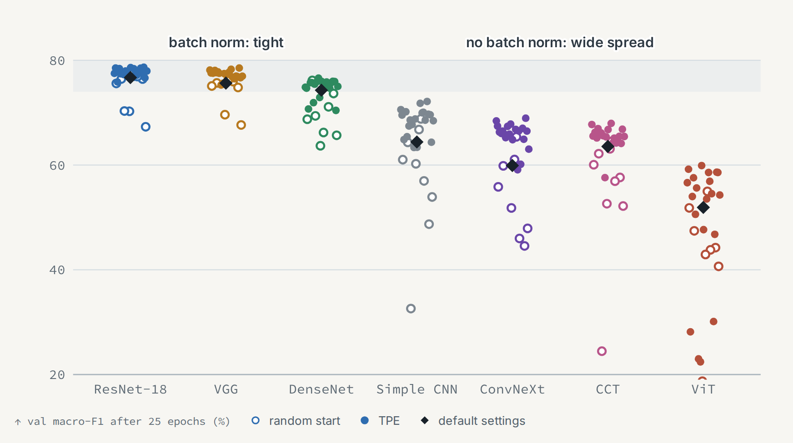
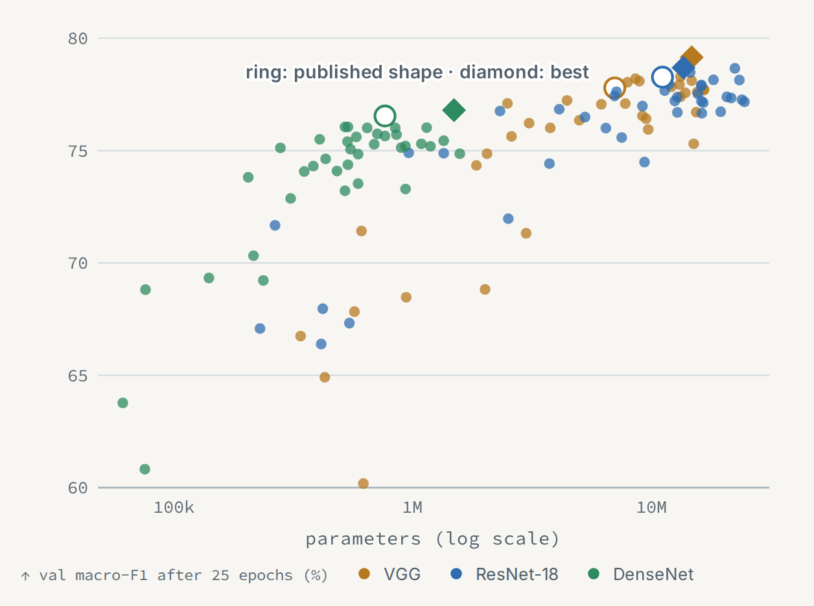

### 4. Long training and grokking

The winners trained 100 epochs at a constant learning rate, with warmup-stable-decay
cooldowns: no gain over 60 epochs, and clear overfitting without regularization. A grokking
test in the setting where grokking was shown on images (Omnigrok: 1,000 faces, large
initialization, MSE loss, weight decay): **validation accuracy rises up to 11 points long
after the training set is memorized, but gradually, never as a sudden jump**. Neural
collapse tracks the late rise. With batch norm, weight decay only produces loss spikes.

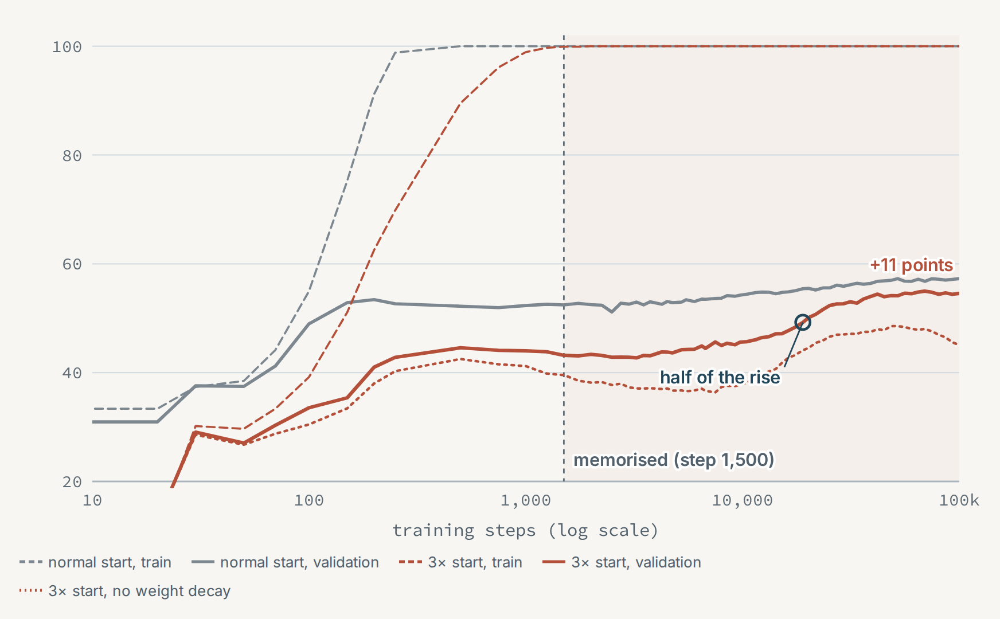
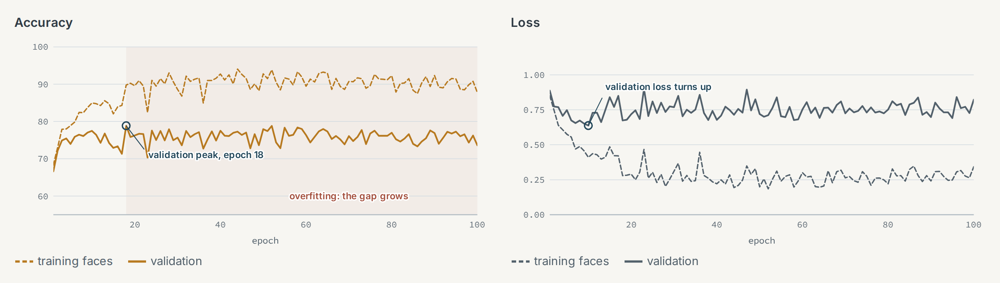
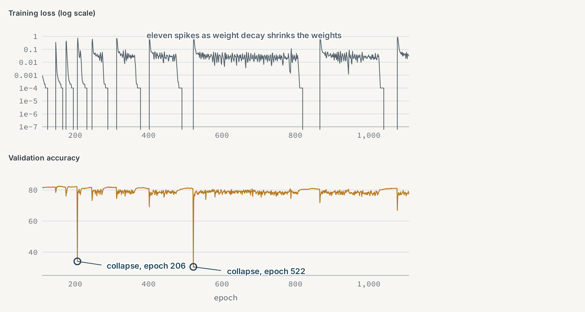

### 5. Compression: low rank, Tucker-2, spatial split, int8

Output-based (data-aware) low rank, Tucker-2, a spatial split of each 3 × 3 kernel, and int8
quantization (post-training, and quantization-aware training), with ranks chosen per layer
from their measured effect and 10 epochs of repair fine-tuning. **ResNet-18 becomes 16 times
smaller at its original test accuracy** (3.2 MB instead of 52.3 MB), or 29 times smaller and
6.8 times faster on one CPU thread at 0.7 points less. It works because the layer outputs
are low-rank while the weights are not. Factorized models are slower on the GPU, and
networks trained small from scratch are as accurate.

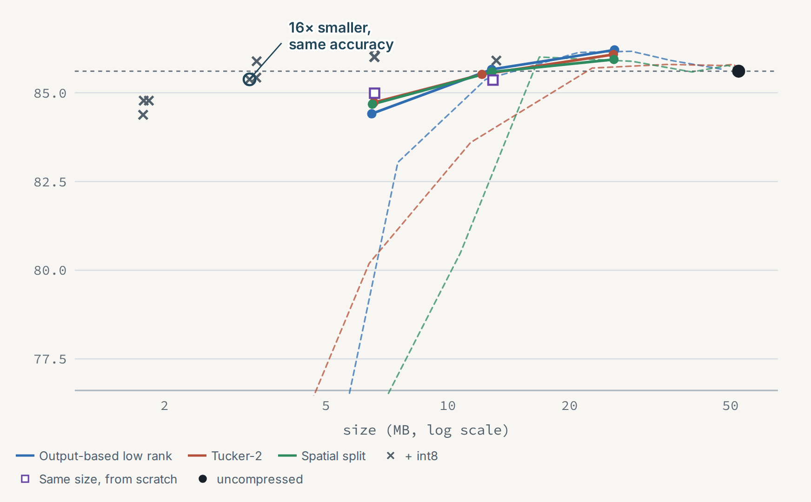
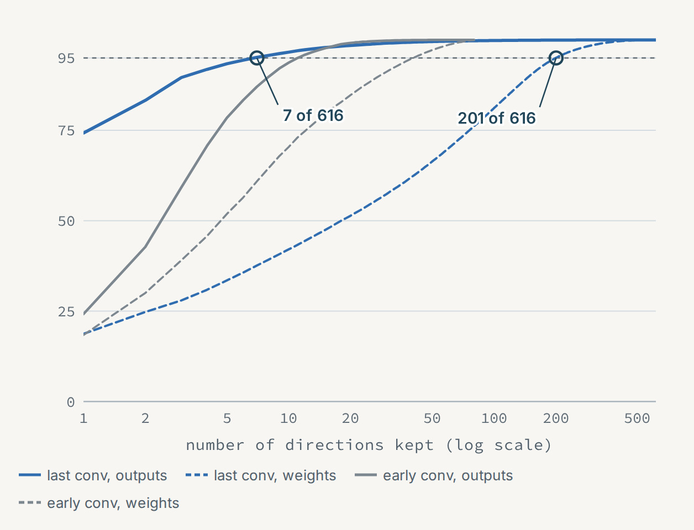
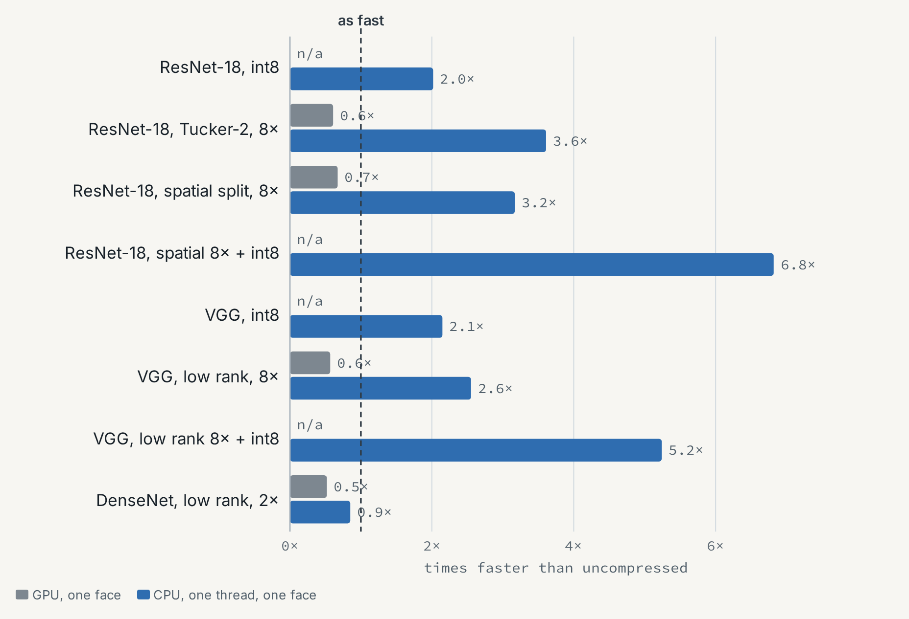

## How it was run

Guesses were written down before each step and checked afterwards
([docs/hypotheses.md](docs/hypotheses.md)), and every step is logged in a dated journal
([docs/journal.md](docs/journal.md)). Every decision was made on the validation set; the test
set only reports results. The follow-up experiments ran with one seed each. The study
rebuilds an earlier course project from scratch, after that project's evaluation turned out
to be invalid.

## Setup

```bash
uv sync
uv run python scripts/01_download.py       # needs a Kaggle token in ~/.kaggle
uv run python scripts/02_inspect.py        # sample sheets for looking at the raw data
uv run python scripts/03_build_dataset.py  # cleaning and unification -> data/processed/dataset.npz
uv run python scripts/04_augment_preview.py # what augmentation does, and how fast
uv run pytest
uv run python scripts/05_baselines.py      # every model with its defaults, 2 seeds
uv run python scripts/06_tune.py           # Optuna, the same budget per model
uv run python scripts/07_final.py          # best settings, 3 seeds, test set
uv run python scripts/06_tune.py --stage shape   # stage 2: the network's shape joins the search
uv run python scripts/07_final.py --stage shape
uv run python scripts/08_figures.py        # figures and tables
uv run python scripts/09_long.py --epochs 100   # long runs; a larger --epochs resumes and extends them
uv run python scripts/10_grok.py            # grokking test on the simple CNN, 1,000 faces
uv run python scripts/11_compress.py        # compression, each method on its own, no fine-tuning
uv run python scripts/12_repair.py          # per-layer ranks for a parameter budget, then repair
uv run python scripts/13_quant.py           # int8 on top of the repaired models, DenseNet with quantization-aware training
uv run python scripts/14_scratch.py         # same-size networks trained from scratch, the fair baseline
uv run python scripts/15_site_data.py       # compact data for the case study
```

`scripts/run_all.sh` and `scripts/run_shape.sh` run the long steps one model per process.

The datasets are not part of this repository. RAF-DB is for non-commercial research only,
and none of its images are redistributed here; the sample faces come from FER2013.
